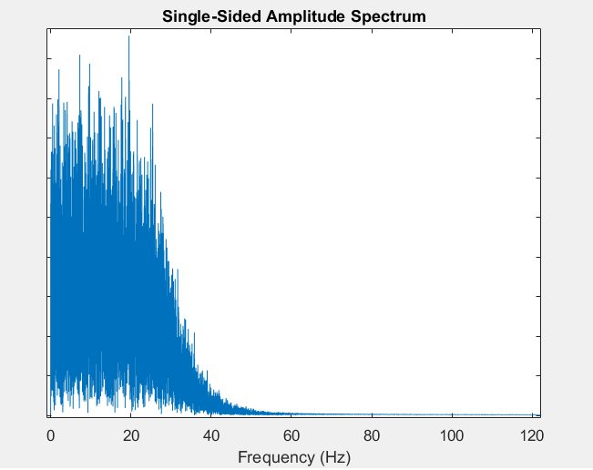
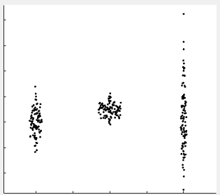
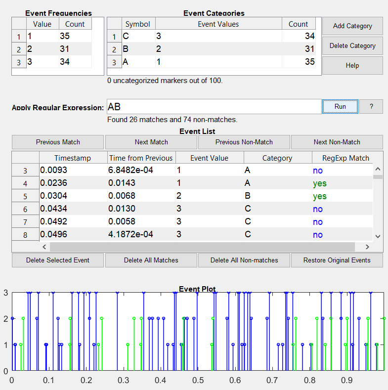
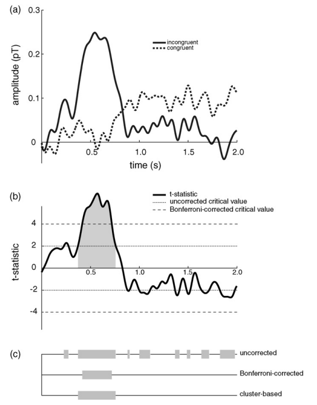
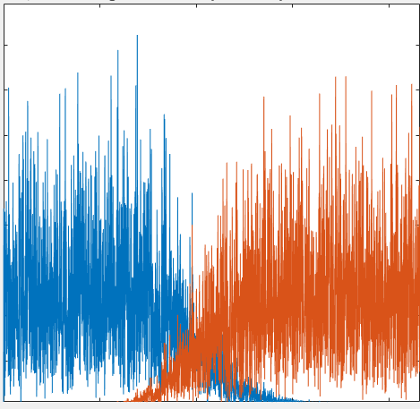
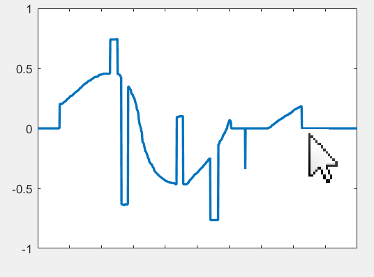

# time_series_analysis_and_statistics
A toolbox of Matlab functions developed over the course of my neuroscience PhD. Focused on EEG analysis but most functions should be widely applicable.

## Overview of functions

### Plotting functions

#### multichanplot

Plot multiple time series data ("channels") arranged vertically in a single axis. Plot a window of a defined length and scroll forward and backward using the arrow keys. Select a subset of channels of display. Control y-axis scale with up and down arrow keys. Use the mouse to visually mark time points and save them to a vector.
Inspired by the BrainVision Analyzer interface for EEG and EEGLab's eegplot function, but works better and faster than the latter IMO.

#### varplot

Plot time seriers with variance indicated by shaded area around the curve. Input your 2D data matrix and automatically produce a plot of the mean and variance in a publication-ready graphical format. Fully wraps around the plot() function supporting all of its existing functionality plus additional options for the variance plot. 
For anyone looking at time x trial style data, this can (and should) replace your standard 'plot(mean(data)) command.

#### plotFFT

plot a single-sided spectrum with true frequency x-axis. This is a simple function that plots the result of the FFT transform, but replacing the arbitrary x-axis with a true freqency axis (using the input sampling frequency). It plots just one side of the symmetrical FFT vector. You can also use the function to extract the frequency axis vector without creating the plot.

#### scalpView

Plots multiple axes on a figure each of which corresponds to the location of an electrode on the scalp.

#### simple violin scatter plot

Scatter plot with categories on the x-axis, with width determined by data point density (like a violin plot but with the width of the violin not explicitly drawn but rather setting the x-axis dispersion of the data points). This is convenient for showing the distribution of categorical data directly using the data points themselves rather than with violin plots or heat maps.

#### Inspect time series events

inspect_events is a graphical tool for inspecting the temporal structure of event markers. It can be used both to manually inspect and modify event timing and values, as well as to automatically remove illegal event seuqences. Filtering for sequences is done using regular expressions and is therefore highly flexible. This was written originally to verify sequences of event markers for EEG experiments, but can be useful for any kind of temporal event data.
The graphical interface uses the findjobj java object finder by Yair Altman, compatibility may depend on this function.

### Testing functions

#### permutest

Cluster-based permutation test (non-parametric test for significance) for dependent or independent measures of 1-D or 2-D data.
Based on Maris & Oostenveld 2007 for 1-D and 2-D vectors. The test statistic is T-Sum - the total of t-values within a cluster of contingent above-threshold data points. See:
Maris, E., & Oostenveld, R. (2007). Nonparametric statistical testing of EEG-and MEG-data. Journal of Neuroscience Methods, 164(1), 177–190. https://doi.org/10.1016/j.jneumeth.2007.03.024

#### FDR (False-Discovery Rate)
Computes the False Discovery Rate (according to Benjamini and Hochberg 1995). The False Discovery Rate is a statistical method of controlling for alpha error across multiple hypotheses, controlling the expected proportion of falsely rejected hypotheses rather than the familywise error rate. See:
Benjamini, Y., & Yosef, H. (1995). Controlling the false discovery rate: a practical and powerful approach to multiple testing. Journal of the Royal Statistical Society, 57(1), 289–300. http://www.jstor.org/stable/2346101. 

#### PLV (Phase-Locking Value)
Compute the Phase Locking Value between two signals across trials, according to Lachaux, Rodriguez, Martinerie, and Varela (1999). The PLV value ranges from 0, indicating random phase differences, to 1 indicating a fixed phase difference.
See:
Lachaux, J. P., Rodriguez, E., Martinerie, J., & Varela, F. J. (1999). Measuring phase synchrony in brain signals. Human Brain Mapping, 8(4), 194–208. http://www.ncbi.nlm.nih.gov/pubmed/10619414

#### SimpleTtest2
A 2-sample t-test that computes only the t-value, skipping the very time-consuming p-value computation. This is good e.g. for permutation tests that need to compute t-values a large number of times as fast as possible. This test assumes equal variances, and allows for unequal sample sizes.

### Data manipulatiopn functions

#### SegAndAvg
Segment a data vector and compute the average across segments. Takes a vector, a list of latencies and a window definition, and returns both the segmented data around those latencies and the average of the segments (This is an extermenly commonly used functonality when doing EEG analysis).

#### PhaseShuffle
Returns a vector of the same size and amplitude spectrum but with shuffled phase information. This is useful for generating different vectors with the same frequency spectrum.

### Filtering functions

Easy filter functions wrapping around matlab's filter design. Support common types (butterworth and cheyshev), causal and noncausal filtering and defining filter degree.
Functions included:
High Pass Filter
Low Pass Filter
Notch Filter

### Data generation functions

#### randwalk
Generates a random walk time series (each point is equal to the previous plus a random value). With additional options like bias toward the origin. Originally written to generate simple artificial biological signals exhibiting 1/f spectrum.

#### vecdraw

Create a vector by drawing it directly on the figure with your mouse. Just define the vector length and then use the mouse to "plot" the values. The vector is returned as the output variable when the figure is closed.

