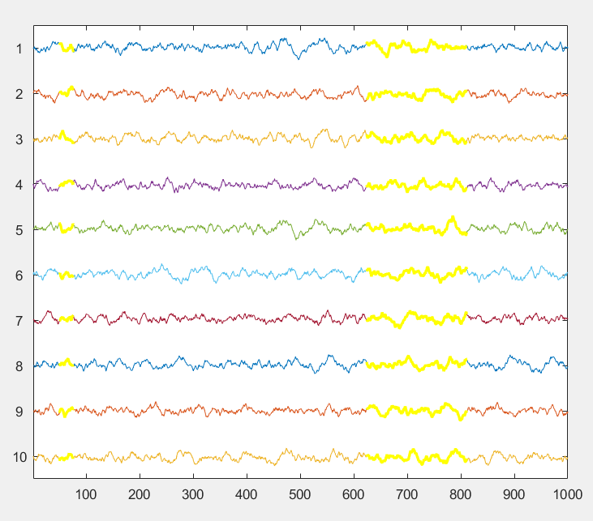
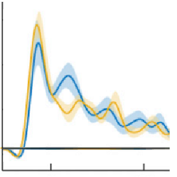

# time_series_analysis_and_statistics
A toolbox of Matlab functions developed over the course of my neuroscience PhD. Focused on EEG analysis but most functions should be widely applicable.

## Overview of functions

### Plotting functions

#### multichanplot

Plot multiple time series data ("channels") arranged vertically in a single axis. Plot a window of a defined length and scroll forward and backward using the arrow keys. Select a subset of channels of display. Control y-axis scale with up and down arrow keys. Use the mouse to visually mark time points and save them to a vector.
Inspired by the BrainVision Analyzer interface for EEG and EEGLab's eegplot function, but works better and faster than the latter IMO.

#### varplot

Plot time seriers with variance indicated by shaded area around the curve. Input your 2D data matrix and automatically produce a plot of the mean and variance in a publication-ready graphical format. Completey wraps around the plot() function supporting all of its existing functionality plus additional options for the variance plot. 
For anyone looking at time x trial style data, this can (and should) replace your standard 'plot(mean(data)) command.

#### plotFFT

plot a single-sided spectrum with true frequency x-axis. This is a simple function that plots the result of the FFT transform, but replacing the arbitrary x-axis with a true freqency axis (using the input sampling frequency). It plots just one side of the symmetrical FFT vector. You can also use the function to extract the frequency axis vector without creating the plot.

#### scalpView

Plots multiple axes on a figure each of which corresponds to the location of an electrode on the scalp.

#### simple violin scatter plot

Scatter plot with categories on the x-axis, with width determined by data point density (like a violin plot but with the width of the violin not explicitly drawn but rather setting the x-axis dispersion of the data points). This is convenient for showing the distribution of categorical data directly using the data points themselves rather than with violin plots or heat maps.

### Testing functions

#### 
